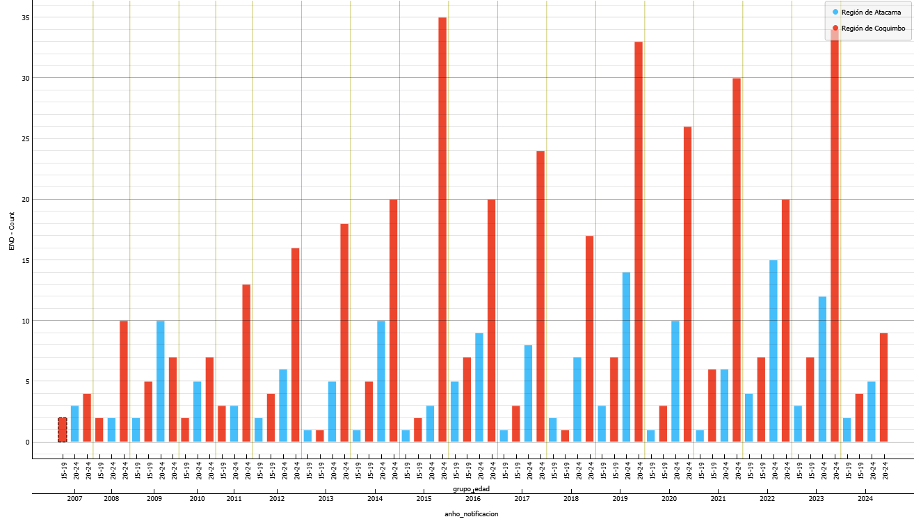
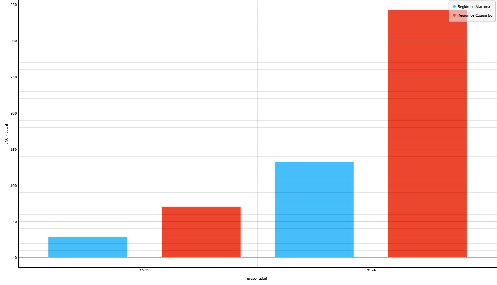
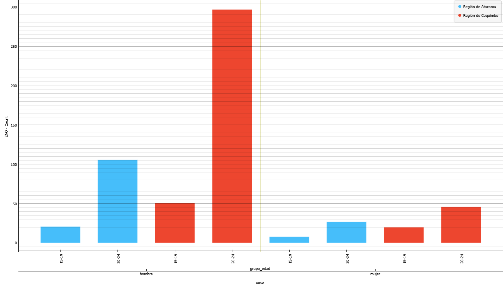
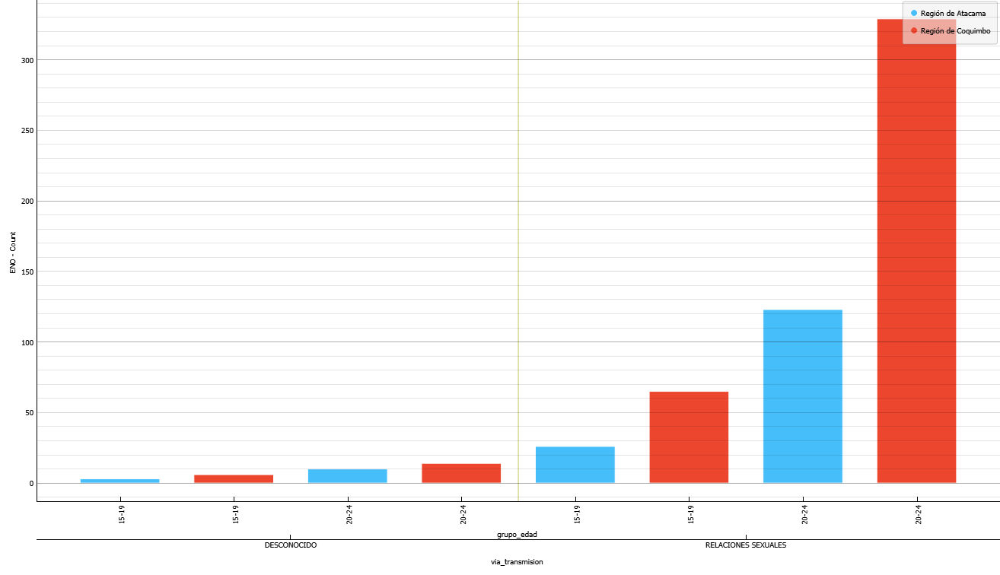
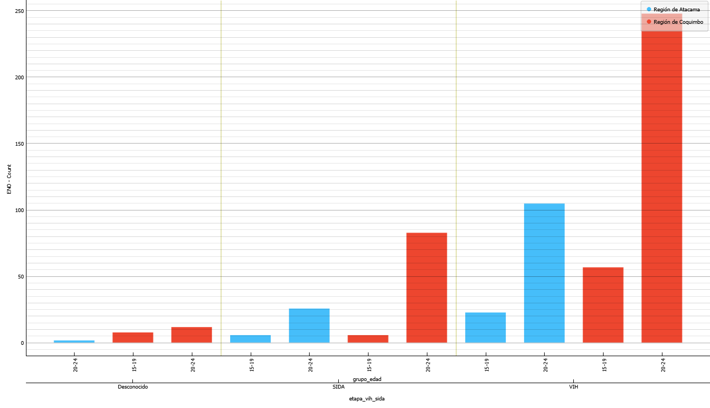

🦠 VIH en Jóvenes del Norte de Chile: Lo que nos Dicen 18 Años de Datos

Análisis reproducible de casos notificados de VIH/SIDA en jóvenes de 15–24 años en Atacama y Coquimbo (2007–2024) usando Orange

📌 Descripción

Este repositorio contiene los datos, flujos de trabajo y visualizaciones que acompañan el artículo publicado en Medium:
[VIH en Jóvenes del Norte de Chile: Lo que nos Dicen 18 Años de Datos]https://medium.com/@brooks.teddy/vih-en-j%C3%B3venes-del-norte-chico-de-chile-lo-que-nos-dicen-18-a%C3%B1os-de-datos-00a3d653bc04

El objetivo es analizar la evolución temporal, diferencias etarias, distribución por género, rutas de transmisión y etapas clínicas de los casos de VIH/SIDA en jóvenes de las regiones de Atacama y Coquimbo entre 2007 y 2024. El análisis utiliza la base de datos ENO del Ministerio de Salud de Chile y fue procesado mediante el software Orange para minería de datos.

📁 Estructura del repositorio

data/ → Archivos originales y procesados de la base ENO (CSV/XLSX).

flows/ → Flujos de trabajo de Orange (.ows) utilizados para el análisis.

outputs/ → Gráficos y tablas generadas en el análisis.

docs/ → Documentos de referencia y documentación técnica (PDF).

⚙️ Tecnologías usadas

Software: Orange Data Mining

Procesos: filtrado, selección de atributos, agrupamiento, conteos y visualización

Visualizaciones: gráficos de barras, tablas pivote

📈 Visualizaciones principales
1️⃣ Evolución temporal de casos (2007–2024)

2️⃣ Comparación etaria acumulada (15–19 vs 20–24)

3️⃣ Distribución por género

4️⃣ Rutas de transmisión y uso de preservativo

5️⃣ Etapa clínica al momento del diagnóstico

📚 Fuentes

Ministerio de Salud de Chile. (2024). Base de Datos de Enfermedades de Notificación Obligatoria (ENO).

Departamento de Epidemiología, MINSAL. (s.f.). Metodología de validación, anonimización y publicación de bases de datos ENO.

📬 Contacto

Autor: Teddy Brooks Caroca
📧 linkedin.com/in/teddy-brooks-caroca/
📌 Aportes, correcciones o comentarios son bienvenidos.
